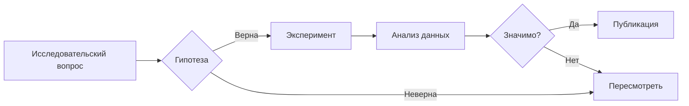

title: "Пример доклада: Недавняя работа"
date: 2024-01-01
# `type: slides` определяется автоматически по папке, но можно задать явно:
type: slides
summary: "Краткий обзор последних исследовательских достижений: мультимодальные LLM, эффективное обучение и ответственный ИИ."
slides:
  theme: black  # Варианты: black, white, league, beige, sky, night, serif, simple, solarized
  highlight_style: dracula  # Тема подсветки синтаксиса кода
  diagram: true  # Включить диаграммы Mermaid для блок-схем и т.д.
  reveal_options:
    controls: true      # Показывать стрелки навигации
    progress: true      # Показывать индикатор выполнения
    slideNumber: true   # Показывать номера слайдов
    hash: true          # Обновлять URL при навигации по слайдам

  # БРЕНДИРОВАНИЕ: Добавьте логотип, заголовок и нижний колонтитул в презентацию
  # Все настройки необязательны — удалите ненужные
  branding:
    # ЛОГОТИП: Отображение логотипа вашей организации
    logo:
      filename: "slides-logo.svg"   # Файл в папке assets/media/ (рекомендуется SVG для любой темы)
      position: "top-right"         # Варианты: top-left, top-right, bottom-left, bottom-right
      width: "50px"                 # Ширина логотипа (высота масштабируется автоматически)
      # margin: "20px"              # Отступ от края (необязательно, по умолчанию: 20px)
    
    # НАЛОЖЕНИЕ ЗАГОЛОВКА: Показывать название презентации на каждом слайде
    title:
      show: true                    # Установите false, чтобы скрыть
      position: "bottom-left"       # Варианты: top-left, top-right, bottom-left, bottom-right
      # text: "Краткий заголовок"   # Необязательно: заменить заголовок страницы пользовательским текстом
      # margin: "20px"              # Отступ от края (необязательно)
    
    # НАЛОЖЕНИЕ АВТОРА: Показывать имя автора на каждом слайде
    # author:
    #   show: true
    #   position: "bottom-right"
    
    # ТЕКСТ В НИЖНЕМ КОЛОНТИТУЛЕ: Отображение копирайта, названия конференции и т.д.
    footer:
      text: "© 2026 HugoBlox"       # Поддерживает Markdown (например, ссылки)
      position: "bottom-center"     # Варианты: top-left, top-right, bottom-left, bottom-right, bottom-center
---


<!-- no-branding -->
# Пример доклада
### Д-р Алекс Джонсон · Meta AI

---

## Обзор исследования

- Мультимодальные LLM
- Эффективное обучение
- Ответственный ИИ

---

## Код и математика

```python
def score(x: int) -> int:
    return x * x
```

$$
E = mc^2
$$

---

## Двухколоночный макет

<div class="r-hstack">

<div style="flex: 1; padding-right: 1rem;">

### Левая колонка

- Пункт А
- Пункт Б  
- Пункт В

</div>

<div style="flex: 1; padding-left: 1rem;">

### Правая колонка

- Деталь 1
- Деталь 2
- Деталь 3

</div>

</div>

---

<!-- Альтернатива: Асимметричные колонки -->

<div style="display: flex; gap: 2rem;">

<div style="flex: 2;">

### Основной контент (2/3 ширины)

Эта колонка занимает вдвое больше места, чем правая.

```python
def example():
    return "код тоже работает"
```

</div>

<div style="flex: 1;">

### Боковая панель (1/3 ширины)

> **Примечание**  
> Ключевые моменты в меньшей колонке

</div>

</div>

---

## Макет «Изображение + Текст»

<div class="r-hstack" style="align-items: center;">

<div style="flex: 1;">


</div>

<div style="flex: 1; padding-left: 2rem;">

### Результаты

- Точность 95%
- Вывод в 10 раз быстрее
- Меньшее потребление памяти

**Прорыв!**

</div>

</div>

---

## Заметки докладчика

Нажмите **S**, чтобы открыть вид докладчика с заметками!

На этом слайде есть скрытые заметки докладчика.

Note:
- Это **заметка докладчика** (видна только в режиме докладчика)
- Нажмите клавишу `S`, чтобы открыть консоль докладчика
- Идеально для запоминания ключевых тезисов
- Можно включать напоминания, тайминг, ссылки
- Также поддерживает форматирование **Markdown**!

---

## Последовательное раскрытие

Контент появляется шаг за шагом:

Сначала появляется первый пункт

Затем второй пункт

Наконец, заключение

Этот можно **выделить**!

Note:
Используйте фрагменты для управления темпом и удержания внимания аудитории. Каждый фрагмент появляется по клику.

---

## Диаграммы с Mermaid



Идеально для: Рабочих процессов, архитектур, процессов

Note:
Диаграммы Mermaid создаются из простого текста. Они контролируются версиями и редактируются где угодно!

---

## Результаты исследования

| Модель | Точность | Скорость | Память |
|--------|----------|----------|--------|
| Базовая | 87.3% | 1.0x | 2GB |
| Наша (v1) | 92.1% | 1.5x | 1.8GB |
| **Наша (v2)** | **95.8%** | **2.3x** | **1.2GB** |

> **Ключевой вывод:** Улучшение на 8.5% по сравнению с базовой моделью при снижении потребления памяти на 40%

Note:
Таблицы идеально подходят для сравнительных результатов. Таблицы Markdown просты и удобны для контроля версий.

---



## Пользовательские фоны

У этого слайда **синий фон**!

Можно настроить:
- Цвета фона
- Фоновые изображения
- Градиенты
- Видео (да, серьёзно!)

Используйте ``

---

## Вертикальная навигация

**Ниже есть ещё контент! ⬇️**

Нажмите **стрелку вниз**, чтобы увидеть подпункты.

Note:
Это демонстрирует функцию вертикальных слайдов Reveal.js. Отлично подходит для дополнительных деталей или углублённого изучения.

---



### Подпункт 1: Детали

Это дополнительный контент в вертикальном стеке.

Перемещайтесь вниз для подробностей или вправо, чтобы перейти к следующей теме →

---



### Подпункт 2: Дополнительные детали

Ещё более подробная информация.

Нажмите **стрелку вверх**, чтобы вернуться, или **стрелку вправо**, чтобы продолжить.

---

## Цитаты и ссылки

> "Лучший способ предсказать будущее — изобрести его."
> 
> — Алан Кей

Или ссылка на исследование:

> Недавняя работа Смита и др. (2024) показывает, что слайды на основе Markdown улучшают воспроизводимость на 78% по сравнению с проприетарными форматами[^1].

[^1]: Смит, Дж. и др. (2024). *Презентации для открытой науки*. Nature Methods.

---

## Медиа: видео с YouTube



Note:
Встраивайте видео с YouTube, используя только ID видео. Идеально для демонстраций, туториалов или интервью.

---

## Медиа: все варианты

Встраивайте различные типы медиа с помощью простых шорткодов:

- **YouTube**: ``
- **Bilibili**: ``
- **Локальные видео**: ``
- **Аудио**: ``

Идеально для демонстраций, интервью, туториалов или подкастов!

Note:
Все типы медиа seamlessly работают в слайдах. Просто используйте соответствующий шорткод.

---

## Интерактивные элементы

Попробуйте эти сочетания клавиш:

- `→` `←` : Навигация по слайдам
- `↓` `↑` : Вертикальная навигация  
- `S` : Заметки докладчика
- `F` : Полный экран
- `O` : Режим обзора
- `/` : Поиск
- `ESC` : Выход из режимов

---
<!-- hide -->
## Демонстрация скрытого слайда (встроенный комментарий)

Этот слайд скрыт с помощью метода комментария `<!-- hide -->`.

Идеально для:
- Контента только для докладчика
- Резервных слайдов
- Материалов в процессе разработки

Note:
Этот слайд не появится в презентации, но останется в исходном коде для справки.

---

## Спасибо

### Вопросы?

- 🌐 Веб-сайт: [hugoblox.com](https://hugoblox.com)
- 🐦 X/Twitter: [@MakeOwnable](https://twitter.com/MakeOwnable)
- 💬 Discord: [Присоединиться к сообществу](https://discord.gg/z8wNYzb)
- ⭐ GitHub: [Поставьте нам звезду!](https://github.com/HugoBlox/kit)

**Все слайды созданы с помощью Markdown** • Без привязки к вендору • Редактируйте где угодно

Note:
Спасибо за внимание! Не стесняйтесь обращаться с вопросами или предложениями.

---

## 🎨 Брендирование слайдов

Добавьте свою идентичность на каждый слайд с помощью простой конфигурации!

**Что можно добавить:**

| Элемент | Варианты расположения |
|---------|----------------------|
| Логотип | top-left, top-right, bottom-left, bottom-right |
| Заголовок | То же, что и выше |
| Автор | То же, что и выше |
| Текст нижнего колонтитула | То же, что и выше + bottom-center |

Отредактируйте раздел `branding:` в front matter вашего слайда (вверху файла).

---

## 📁 Добавление логотипа

1. Поместите логотип в папку `assets/media/`
2. Используйте формат SVG для наилучших результатов (автоматически адаптируется к любой теме!)
3. Добавьте в front matter:

```yaml
branding:
  logo:
    filename: "your-logo.svg"  # Должен быть в assets/media/
    position: "top-right"
    width: "60px"
```

**Совет:** SVG с `fill="currentColor"` автоматически подстраиваются под цвета темы!

---

## 📝 Наложение заголовка и автора

Показывайте название презентации и/или автора на каждом слайде:

```yaml
branding:
  title:
    show: true
    position: "bottom-left"
    text: "Краткий заголовок"  # Необязательно: заменить длинный заголовок страницы
  
  author:
    show: true
    position: "bottom-right"
```

Автор определяется автоматически из front matter страницы (`author:` или `authors:`).

---

## 📄 Текст нижнего колонтитула

Добавьте копирайт, название конференции или любой постоянный текст:

```yaml
branding:
  footer:
    text: "© 2024 Ваше Имя · ICML 2024"
    position: "bottom-center"
```

**Совет:** Поддерживает Markdown! Используйте `[Ссылка](url)` для кликабельных ссылок.

---

<!-- no-branding -->

## 🔇 Скрытие брендирования на отдельных слайдах

Иногда нужен чистый слайд (титульные слайды, полноэкранные изображения).

Добавьте этот комментарий в **начало** содержимого слайда:

```markdown
<!-- no-branding -->
## Мой чистый слайд

Содержимое...
```

☝️ **На этом слайде используется `<!-- no-branding -->`** — обратите внимание, нет логотипа или наложений!

---

<!-- no-header -->

## 🔇 Выборочное скрытие

Скрыть только верхний колонтитул (логотип + заголовок):

```markdown
<!-- no-header -->
```

Или только нижний колонтитул (автор + текст):

```markdown
<!-- no-footer -->
```

☝️ **На этом слайде используется `<!-- no-header -->`** — нижний колонтитул всё ещё виден внизу!

---

<!-- no-footer -->

## ✅ Краткий справочник

| Комментарий | Скрывает |
|-------------|----------|
| `<!-- no-branding -->` | Всё (логотип, заголовок, автора, нижний колонтитул) |
| `<!-- no-header -->` | Логотип + наложение заголовка |
| `<!-- no-footer -->` | Автор + текст нижнего колонтитула |

☝️ **На этом слайде используется `<!-- no-footer -->`** — логотип всё ещё виден сверху!

---

## 🚀 Начните работу

1. Скопируйте front matter этого примера как отправную точку
2. Замените логотип на свой в `assets/media/`
3. Настройте расположение и текст
4. Используйте `<!-- no-branding -->` для специальных слайдов

**Совет профессионала:** Установите общесайтовые значения по умолчанию в `config/_default/params.yaml` в разделе `slides.branding`!
